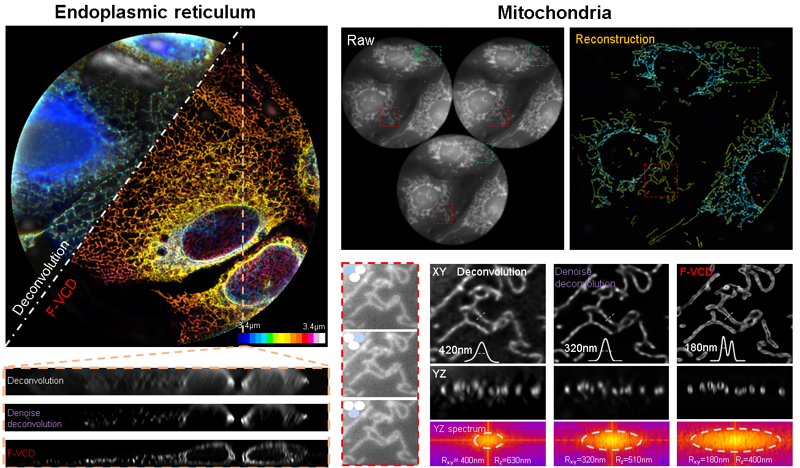

## F-VCD package for FLFM 3D reconstruction proposed in our paper:

[Video-rate 3D imaging of living cells using Fourier view-channel-depth (F-VCD) light field microscopy](https://doi.org/10.1038/s42003-023-05636-x)





## System Requirements

- Windows 10. Linux should be able to run the code (based on python).
- Graphics: Nvidia GPU (RTX 3090 recommended)
- Memory: >64 GB RAM (128 recommended)
- Hard Drive: ~50GB free space (SSD recommended)


## Installation instructions

- Matlab: download from [official website](https://www.mathworks.com)
- Dependencies installation (using [conda](https://docs.conda.io/en/latest/) for environment installation):
  We provide package list for required environment installation. To use this, run the following commend inside a conda console
  ```
  conda env create -f ./Code/DL_net/environment/f_vcd_environment.yml
  ```


#### Note: More details are reffered to the user's manual ("Environment installation",Seciton: F-VCD Training && Validation)


## How to use
### Training
   #### 1. Training data preparation: ####
  We provide example data for network training. Please download from [Google Drive](https://drive.google.com/drive/folders/14GvVi1PoLsYONBUv94tPcSDEz0BZEo3f)
#### Note: If users want to build their own training dataset, please refer to the user's manual (Seciton:Training paris generation)
   #### 2. Network training: ####
Before training F-VCD, users need to check whether the installed environment was activated or not. Then, users need to modify the parameters in network configuration file: [config.py](./Code/DL_net/config.py). The detailed descriptions of these parameters are listed below:
  ```
label: the name of training model

config.img_setting.img_size: patch size of input noisy LF.

config.img_setting.sr_factor: upsampling factor from noisy LF to clean LF

config.img_setting.ReScale_factor: upsampling factor from clean LF to 3D stacks

config.img_setting.Nnum: the view number of input noisy LF

config.channels_interp: filter number of F-VCD

config.sub_pixel: upsampling factor
  ```
Afer entering the baisc parameters, users can train the F-VCD model yourself, run:
  ```
  python ./Code/DL_net/train.py
  ```
### Validation
To using the trained model to inference 3D stack from LF, users need to enter the validation data path in [config.py](./Code/DL_net/config.py):
  ```
    Line 76: config.VALID.lf2d_path='{user-defined path}'
  ```
and run [eval_test.py](./Code/DL_net/config.py):
  ```
    python ./Code/DL_net/eval_test.py
  ```


#### Note: More details about network traing and validation are refered to user's manual

## Citation

If you use this code and relevant data, please cite the corresponding paper where original methods appeared: Yi, C., Zhu, L., Sun, J. et al. Video-rate 3D imaging of living cells using Fourier view-channel-depth light field microscopy. Commun Biol 6, 1259 (2023).DOI:https://doi.org/10.1038/s42003-023-05636-x
Correspondence
Should you have any questions regarding this code and the corresponding results, please contact Chengqiang Yi (cqyi@hust.edu.cn)
